# Performance Monitoring Plan
# 性能监控方案 v1.0

## 目录
1. [概述](#概述)
2. [性能指标体系](#性能指标体系)
3. [监控架构](#监控架构)
4. [前端性能监控](#前端性能监控)
5. [后端性能监控](#后端性能监控)
6. [数据库性能监控](#数据库性能监控)
7. [iOS应用性能监控](#ios应用性能监控)
8. [性能预算](#性能预算)
9. [告警策略](#告警策略)
10. [性能优化流程](#性能优化流程)
11. [工具选型](#工具选型)
12. [实施路线图](#实施路线图)

## 概述

### 目标
- 建立全面的性能监控体系
- 实时发现性能瓶颈
- 提供数据驱动的优化决策
- 确保用户体验始终流畅
- 支持业务快速增长

### 原则
1. **全栈监控**：覆盖前端、后端、数据库、基础设施
2. **实时性**：秒级数据采集和告警
3. **可视化**：直观的仪表板和报表
4. **自动化**：自动发现问题和生成报告
5. **可操作性**：提供具体的优化建议

## 性能指标体系

### 用户体验指标 (User-Centric Metrics)
```yaml
Web Vitals:
  LCP (Largest Contentful Paint):
    target: < 2.5s
    good: < 2.5s
    needs_improvement: 2.5s - 4.0s
    poor: > 4.0s
  
  FID (First Input Delay):
    target: < 100ms
    good: < 100ms
    needs_improvement: 100ms - 300ms
    poor: > 300ms
  
  CLS (Cumulative Layout Shift):
    target: < 0.1
    good: < 0.1
    needs_improvement: 0.1 - 0.25
    poor: > 0.25

Additional Metrics:
  FCP (First Contentful Paint): < 1.8s
  TTFB (Time to First Byte): < 600ms
  TTI (Time to Interactive): < 3.8s
  TBT (Total Blocking Time): < 300ms
```

### 应用性能指标 (Application Metrics)
```yaml
API Performance:
  response_time_p50: < 100ms
  response_time_p95: < 500ms
  response_time_p99: < 1000ms
  error_rate: < 0.1%
  throughput: > 1000 req/s

Database Performance:
  query_time_p50: < 10ms
  query_time_p95: < 50ms
  connection_pool_usage: < 80%
  slow_query_rate: < 1%

Resource Usage:
  cpu_usage: < 70%
  memory_usage: < 80%
  disk_io_wait: < 10%
  network_bandwidth: < 70%
```

### 业务性能指标 (Business Metrics)
```yaml
User Actions:
  task_completion_time: < 2s
  page_load_time: < 3s
  search_response_time: < 500ms
  file_upload_speed: > 1MB/s

Reliability:
  uptime: > 99.9%
  error_budget: < 0.1%
  mttr: < 30 minutes
  deployment_success_rate: > 95%
```

## 监控架构

### 数据流架构
```
┌─────────────┐     ┌─────────────┐     ┌─────────────┐
│   Browser   │────▶│  Collector  │────▶│   Storage   │
│   (RUM)     │     │   (API)     │     │ (TimeSeries)│
└─────────────┘     └─────────────┘     └─────────────┘
                            │                    │
┌─────────────┐             │                    ▼
│    iOS      │─────────────┘            ┌─────────────┐
│    App      │                          │  Analytics  │
└─────────────┘                          │   Engine    │
                                         └─────────────┘
┌─────────────┐                                 │
│   Server    │──────────────────────────────────┘
│   (APM)     │
└─────────────┘
```

### 技术栈
```yaml
Collection:
  - Browser: Web Vitals API + Custom Metrics
  - iOS: MetricKit + Custom Telemetry
  - Server: OpenTelemetry
  - Database: pg_stat_statements

Processing:
  - Stream Processing: Apache Kafka
  - Aggregation: ClickHouse
  - Analysis: Apache Spark

Storage:
  - Metrics: Prometheus + VictoriaMetrics
  - Logs: Elasticsearch
  - Traces: Jaeger

Visualization:
  - Dashboards: Grafana
  - Alerts: AlertManager
  - Reports: Metabase
```

## 前端性能监控

### 1. Real User Monitoring (RUM)
```typescript
// performance-monitor.ts
class PerformanceMonitor {
  private metrics: Map<string, any> = new Map();
  
  init() {
    // Web Vitals
    this.observeWebVitals();
    
    // Custom metrics
    this.trackPageLoad();
    this.trackResourceTiming();
    this.trackUserInteractions();
    this.trackErrors();
    
    // Send data
    this.startReporting();
  }
  
  private observeWebVitals() {
    // LCP
    new PerformanceObserver((list) => {
      const entries = list.getEntries();
      const lastEntry = entries[entries.length - 1];
      this.metrics.set('lcp', lastEntry.renderTime || lastEntry.loadTime);
    }).observe({ entryTypes: ['largest-contentful-paint'] });
    
    // FID
    new PerformanceObserver((list) => {
      const firstInput = list.getEntries()[0];
      this.metrics.set('fid', firstInput.processingStart - firstInput.startTime);
    }).observe({ entryTypes: ['first-input'] });
    
    // CLS
    let clsValue = 0;
    new PerformanceObserver((list) => {
      for (const entry of list.getEntries()) {
        if (!entry.hadRecentInput) {
          clsValue += entry.value;
          this.metrics.set('cls', clsValue);
        }
      }
    }).observe({ entryTypes: ['layout-shift'] });
  }
  
  private trackPageLoad() {
    window.addEventListener('load', () => {
      const navigation = performance.getEntriesByType('navigation')[0];
      this.metrics.set('pageLoad', {
        dns: navigation.domainLookupEnd - navigation.domainLookupStart,
        tcp: navigation.connectEnd - navigation.connectStart,
        ttfb: navigation.responseStart - navigation.requestStart,
        download: navigation.responseEnd - navigation.responseStart,
        domParse: navigation.domInteractive - navigation.domLoading,
        domReady: navigation.domContentLoadedEventEnd - navigation.domContentLoadedEventStart,
        load: navigation.loadEventEnd - navigation.loadEventStart,
        total: navigation.loadEventEnd - navigation.fetchStart
      });
    });
  }
  
  private trackResourceTiming() {
    const resources = performance.getEntriesByType('resource');
    const grouped = resources.reduce((acc, resource) => {
      const type = resource.initiatorType;
      if (!acc[type]) acc[type] = [];
      acc[type].push({
        name: resource.name,
        duration: resource.duration,
        size: resource.transferSize,
        protocol: resource.nextHopProtocol
      });
      return acc;
    }, {});
    
    this.metrics.set('resources', grouped);
  }
  
  private trackUserInteractions() {
    // Track click interactions
    document.addEventListener('click', (e) => {
      const target = e.target as HTMLElement;
      const interaction = {
        type: 'click',
        target: target.tagName,
        id: target.id,
        class: target.className,
        timestamp: Date.now(),
        x: e.clientX,
        y: e.clientY
      };
      this.reportInteraction(interaction);
    });
  }
  
  private startReporting() {
    // Batch and send metrics every 10 seconds
    setInterval(() => {
      const data = {
        url: window.location.href,
        userAgent: navigator.userAgent,
        timestamp: Date.now(),
        metrics: Object.fromEntries(this.metrics)
      };
      
      // Send to analytics endpoint
      navigator.sendBeacon('/api/analytics/performance', JSON.stringify(data));
    }, 10000);
  }
}
```

### 2. 合成监控 (Synthetic Monitoring)
```yaml
# lighthouse-ci.yml
ci:
  collect:
    urls:
      - https://www.levelupsolo.net/
      - https://www.levelupsolo.net/dashboard
      - https://www.levelupsolo.net/tasks
    numberOfRuns: 3
    settings:
      preset: desktop
      throttling:
        cpuSlowdownMultiplier: 1
      
  assert:
    preset: lighthouse:recommended
    assertions:
      # Performance
      first-contentful-paint:
        - error
        - maxNumericValue: 2000
      speed-index:
        - error
        - maxNumericValue: 4000
      interactive:
        - error
        - maxNumericValue: 5000
      
      # Accessibility
      accessibility:
        - error
        - minScore: 0.9
      
      # Best Practices
      uses-http2:
        - warn
      uses-long-cache-ttl:
        - warn
```

### 3. 自定义性能追踪
```typescript
// performance-tracker.ts
export class PerformanceTracker {
  private marks: Map<string, number> = new Map();
  
  // 标记开始时间
  mark(name: string) {
    this.marks.set(name, performance.now());
  }
  
  // 测量持续时间
  measure(name: string, startMark: string, endMark?: string) {
    const start = this.marks.get(startMark);
    const end = endMark ? this.marks.get(endMark) : performance.now();
    
    if (start) {
      const duration = end - start;
      
      // 记录到 Performance API
      performance.measure(name, {
        start,
        end,
        detail: { duration }
      });
      
      // 发送到分析系统
      this.report('measure', { name, duration });
      
      return duration;
    }
  }
  
  // 追踪组件渲染
  trackComponentRender(componentName: string) {
    const startMark = `${componentName}-render-start`;
    const endMark = `${componentName}-render-end`;
    
    return {
      start: () => this.mark(startMark),
      end: () => this.measure(`${componentName}-render`, startMark, endMark)
    };
  }
  
  // 追踪 API 调用
  async trackAPICall<T>(name: string, apiCall: () => Promise<T>): Promise<T> {
    const start = performance.now();
    
    try {
      const result = await apiCall();
      const duration = performance.now() - start;
      
      this.report('api', {
        name,
        duration,
        status: 'success'
      });
      
      return result;
    } catch (error) {
      const duration = performance.now() - start;
      
      this.report('api', {
        name,
        duration,
        status: 'error',
        error: error.message
      });
      
      throw error;
    }
  }
}
```

## 后端性能监控

### 1. Application Performance Monitoring (APM)
```typescript
// apm-middleware.ts
import { Request, Response, NextFunction } from 'express';
import { Histogram, Counter, Gauge } from 'prom-client';

// Metrics
const httpDuration = new Histogram({
  name: 'http_request_duration_seconds',
  help: 'Duration of HTTP requests in seconds',
  labelNames: ['method', 'route', 'status_code'],
  buckets: [0.01, 0.05, 0.1, 0.5, 1, 2, 5]
});

const httpRequests = new Counter({
  name: 'http_requests_total',
  help: 'Total number of HTTP requests',
  labelNames: ['method', 'route', 'status_code']
});

const activeRequests = new Gauge({
  name: 'http_requests_active',
  help: 'Number of active HTTP requests'
});

export function apmMiddleware() {
  return (req: Request, res: Response, next: NextFunction) => {
    const start = Date.now();
    activeRequests.inc();
    
    // Capture route pattern
    let route = req.route?.path || req.path;
    route = route.replace(/:[^/]+/g, ':id'); // Normalize params
    
    // Track response
    res.on('finish', () => {
      const duration = (Date.now() - start) / 1000;
      const labels = {
        method: req.method,
        route,
        status_code: res.statusCode.toString()
      };
      
      httpDuration.observe(labels, duration);
      httpRequests.inc(labels);
      activeRequests.dec();
      
      // Log slow requests
      if (duration > 1) {
        console.warn('Slow request detected:', {
          method: req.method,
          url: req.url,
          duration: `${duration}s`,
          statusCode: res.statusCode
        });
      }
    });
    
    next();
  };
}

// Distributed tracing
import { trace, context, SpanStatusCode } from '@opentelemetry/api';

const tracer = trace.getTracer('levelupsolo-api', '1.0.0');

export function tracingMiddleware() {
  return (req: Request, res: Response, next: NextFunction) => {
    const span = tracer.startSpan(`${req.method} ${req.path}`, {
      attributes: {
        'http.method': req.method,
        'http.url': req.url,
        'http.target': req.path,
        'http.host': req.hostname,
        'http.scheme': req.protocol,
        'user.id': req.user?.id
      }
    });
    
    // Add span to context
    context.with(trace.setSpan(context.active(), span), () => {
      res.on('finish', () => {
        span.setAttributes({
          'http.status_code': res.statusCode,
          'http.response_size': res.get('content-length') || 0
        });
        
        if (res.statusCode >= 400) {
          span.setStatus({
            code: SpanStatusCode.ERROR,
            message: `HTTP ${res.statusCode}`
          });
        }
        
        span.end();
      });
      
      next();
    });
  };
}
```

### 2. 自定义业务指标
```typescript
// business-metrics.ts
import { Counter, Gauge, Histogram } from 'prom-client';

// Task metrics
export const taskCompletions = new Counter({
  name: 'task_completions_total',
  help: 'Total number of completed tasks',
  labelNames: ['skill_type', 'user_tier']
});

export const taskCompletionTime = new Histogram({
  name: 'task_completion_duration_hours',
  help: 'Time taken to complete tasks in hours',
  labelNames: ['skill_type'],
  buckets: [0.5, 1, 2, 4, 8, 24, 48, 168] // 30min to 1 week
});

// User metrics
export const activeUsers = new Gauge({
  name: 'active_users_total',
  help: 'Number of active users in the last 24 hours'
});

export const userLevel = new Histogram({
  name: 'user_level_distribution',
  help: 'Distribution of user levels',
  buckets: [1, 5, 10, 20, 30, 40, 50, 75, 100]
});

// Performance metrics
export const apiCacheHitRate = new Gauge({
  name: 'api_cache_hit_rate',
  help: 'Cache hit rate for API responses',
  labelNames: ['endpoint']
});

// Example usage in business logic
export async function completeTask(taskId: number, userId: number) {
  const startTime = Date.now();
  
  try {
    const task = await getTask(taskId);
    const user = await getUser(userId);
    
    // Business logic...
    await markTaskComplete(taskId);
    
    // Track metrics
    taskCompletions.inc({
      skill_type: task.skillType,
      user_tier: user.tier
    });
    
    const completionHours = (Date.now() - task.createdAt) / (1000 * 60 * 60);
    taskCompletionTime.observe(
      { skill_type: task.skillType },
      completionHours
    );
    
    return { success: true };
  } catch (error) {
    // Track errors
    throw error;
  }
}
```

## 数据库性能监控

### 1. PostgreSQL 监控配置
```sql
-- Enable query statistics
CREATE EXTENSION IF NOT EXISTS pg_stat_statements;

-- Configure logging
ALTER SYSTEM SET log_min_duration_statement = 1000; -- Log queries > 1s
ALTER SYSTEM SET log_checkpoints = on;
ALTER SYSTEM SET log_connections = on;
ALTER SYSTEM SET log_disconnections = on;
ALTER SYSTEM SET log_lock_waits = on;
ALTER SYSTEM SET log_temp_files = 0;

-- Performance views
CREATE OR REPLACE VIEW performance_metrics AS
SELECT
  -- Query performance
  (SELECT count(*) FROM pg_stat_statements) as total_queries,
  (SELECT sum(calls) FROM pg_stat_statements) as total_calls,
  (SELECT avg(mean_exec_time) FROM pg_stat_statements) as avg_query_time,
  
  -- Connection metrics
  (SELECT count(*) FROM pg_stat_activity WHERE state = 'active') as active_connections,
  (SELECT count(*) FROM pg_stat_activity WHERE state = 'idle') as idle_connections,
  (SELECT count(*) FROM pg_stat_activity WHERE wait_event_type IS NOT NULL) as waiting_connections,
  
  -- Cache hit rates
  (SELECT sum(heap_blks_hit) / NULLIF(sum(heap_blks_hit + heap_blks_read), 0) FROM pg_statio_user_tables) as cache_hit_ratio,
  
  -- Table statistics
  (SELECT sum(n_tup_ins + n_tup_upd + n_tup_del) FROM pg_stat_user_tables) as total_dml_operations,
  (SELECT sum(n_dead_tup) FROM pg_stat_user_tables) as total_dead_tuples;

-- Slow query analysis
CREATE OR REPLACE VIEW slow_queries AS
SELECT
  query,
  calls,
  mean_exec_time,
  total_exec_time,
  min_exec_time,
  max_exec_time,
  stddev_exec_time,
  rows
FROM pg_stat_statements
WHERE mean_exec_time > 100 -- queries averaging > 100ms
ORDER BY mean_exec_time DESC
LIMIT 20;

-- Index usage
CREATE OR REPLACE VIEW index_usage AS
SELECT
  schemaname,
  tablename,
  indexname,
  idx_scan,
  idx_tup_read,
  idx_tup_fetch,
  CASE 
    WHEN idx_scan = 0 THEN 'UNUSED'
    WHEN idx_scan < 100 THEN 'RARELY USED'
    ELSE 'ACTIVE'
  END as usage_status
FROM pg_stat_user_indexes
ORDER BY idx_scan;
```

### 2. 查询性能追踪
```typescript
// db-performance.ts
import { Pool } from 'pg';
import { Histogram } from 'prom-client';

const queryDuration = new Histogram({
  name: 'db_query_duration_seconds',
  help: 'Database query duration in seconds',
  labelNames: ['query_type', 'table'],
  buckets: [0.001, 0.005, 0.01, 0.05, 0.1, 0.5, 1, 5]
});

export class PerformancePool extends Pool {
  async query(text: string, params?: any[]) {
    const start = Date.now();
    const queryType = text.trim().split(' ')[0].toUpperCase();
    const table = this.extractTableName(text);
    
    try {
      const result = await super.query(text, params);
      const duration = (Date.now() - start) / 1000;
      
      // Track metrics
      queryDuration.observe({ query_type: queryType, table }, duration);
      
      // Log slow queries
      if (duration > 1) {
        console.warn('Slow query detected:', {
          query: text,
          params,
          duration: `${duration}s`,
          rows: result.rowCount
        });
      }
      
      return result;
    } catch (error) {
      const duration = (Date.now() - start) / 1000;
      
      // Track failed queries
      queryDuration.observe({ query_type: 'ERROR', table }, duration);
      
      throw error;
    }
  }
  
  private extractTableName(query: string): string {
    const match = query.match(/(?:FROM|INTO|UPDATE)\s+(\w+)/i);
    return match ? match[1] : 'unknown';
  }
}
```

## iOS应用性能监控

### 1. MetricKit 集成
```swift
// PerformanceMonitor.swift
import MetricKit

class PerformanceMonitor: NSObject, MXMetricManagerSubscriber {
    static let shared = PerformanceMonitor()
    
    override init() {
        super.init()
        MXMetricManager.shared.add(self)
    }
    
    // Receive daily metrics
    func didReceive(_ payloads: [MXMetricPayload]) {
        for payload in payloads {
            processMetrics(payload)
        }
    }
    
    // Receive diagnostics
    func didReceive(_ payloads: [MXDiagnosticPayload]) {
        for payload in payloads {
            processDiagnostics(payload)
        }
    }
    
    private func processMetrics(_ payload: MXMetricPayload) {
        // App launch metrics
        if let launchMetrics = payload.applicationLaunchMetrics {
            reportMetric("app_launch_time", 
                        value: launchMetrics.histogrammedTimeToFirstDraw.bucketValues)
            reportMetric("app_resume_time", 
                        value: launchMetrics.histogrammedApplicationResumeTime.bucketValues)
        }
        
        // Responsiveness metrics
        if let responsiveness = payload.applicationResponsivenessMetrics {
            reportMetric("hang_time", 
                        value: responsiveness.histogrammedApplicationHangTime.bucketValues)
        }
        
        // Memory metrics
        if let memory = payload.memoryMetrics {
            reportMetric("peak_memory", 
                        value: memory.peakMemoryUsage.value)
            reportMetric("avg_memory", 
                        value: memory.averageSuspendedMemory.value)
        }
        
        // Disk metrics
        if let disk = payload.diskIOMetrics {
            reportMetric("disk_writes", 
                        value: disk.cumulativeLogicalWrites.value)
        }
        
        // Network metrics
        if let network = payload.networkTransferMetrics {
            reportMetric("cellular_upload", 
                        value: network.cumulativeCellularUpload.value)
            reportMetric("cellular_download", 
                        value: network.cumulativeCellularDownload.value)
        }
    }
    
    private func reportMetric(_ name: String, value: Any) {
        // Send to analytics backend
        AnalyticsService.shared.track("ios_performance", properties: [
            "metric": name,
            "value": value,
            "timestamp": Date()
        ])
    }
}

// Custom performance tracking
class CustomPerformanceTracker {
    static let shared = CustomPerformanceTracker()
    
    private var signposts: [String: OSSignpostID] = [:]
    private let log = OSLog(subsystem: "com.levelupsolo", category: "Performance")
    
    // Track view controller lifecycle
    func trackViewController(_ viewController: UIViewController) {
        let name = String(describing: type(of: viewController))
        
        // Track load time
        let loadSignpost = OSSignpostID(log: log)
        os_signpost(.begin, log: log, name: "VC Load", signpostID: loadSignpost, "%@", name)
        
        // Swizzle viewDidAppear to end tracking
        let originalMethod = class_getInstanceMethod(type(of: viewController), #selector(UIViewController.viewDidAppear(_:)))!
        let swizzledMethod = class_getInstanceMethod(type(of: self), #selector(swizzled_viewDidAppear(_:)))!
        method_exchangeImplementations(originalMethod, swizzledMethod)
    }
    
    @objc private func swizzled_viewDidAppear(_ animated: Bool) {
        // End tracking
        if let signpost = signposts[String(describing: type(of: self))] {
            os_signpost(.end, log: log, name: "VC Load", signpostID: signpost)
        }
        
        // Call original
        swizzled_viewDidAppear(animated)
    }
    
    // Track network requests
    func trackNetworkRequest(_ request: URLRequest) -> URLSessionTaskMetrics {
        let task = URLSession.shared.dataTask(with: request)
        
        // Collect metrics after completion
        task.delegate = self
        
        return task.metrics
    }
}

// Memory monitoring
class MemoryMonitor {
    private var timer: Timer?
    
    func startMonitoring() {
        timer = Timer.scheduledTimer(withTimeInterval: 10, repeats: true) { _ in
            self.checkMemoryUsage()
        }
    }
    
    private func checkMemoryUsage() {
        var info = mach_task_basic_info()
        var count = mach_msg_type_number_t(MemoryLayout<mach_task_basic_info>.size) / 4
        
        let result = withUnsafeMutablePointer(to: &info) {
            $0.withMemoryRebound(to: integer_t.self, capacity: 1) {
                task_info(mach_task_self_,
                         task_flavor_t(MACH_TASK_BASIC_INFO),
                         $0,
                         &count)
            }
        }
        
        if result == KERN_SUCCESS {
            let usedMemory = Double(info.resident_size) / 1024.0 / 1024.0
            
            // Report memory usage
            PerformanceMonitor.shared.reportMetric("memory_usage_mb", value: usedMemory)
            
            // Alert if memory is too high
            if usedMemory > 200 { // 200MB threshold
                print("⚠️ High memory usage: \(usedMemory)MB")
            }
        }
    }
}
```

### 2. 自定义性能指标
```swift
// AppPerformanceMetrics.swift
struct AppPerformanceMetrics {
    // Screen rendering
    static func measureScreenRender(_ screen: String, block: () -> Void) {
        let startTime = CFAbsoluteTimeGetCurrent()
        
        block()
        
        let renderTime = (CFAbsoluteTimeGetCurrent() - startTime) * 1000
        Analytics.track("screen_render", properties: [
            "screen": screen,
            "duration_ms": renderTime
        ])
        
        if renderTime > 100 {
            print("⚠️ Slow screen render: \(screen) took \(renderTime)ms")
        }
    }
    
    // Core Data performance
    static func measureCoreDataOperation(_ operation: String, block: () throws -> Void) rethrows {
        let startTime = CFAbsoluteTimeGetCurrent()
        
        defer {
            let duration = (CFAbsoluteTimeGetCurrent() - startTime) * 1000
            Analytics.track("coredata_operation", properties: [
                "operation": operation,
                "duration_ms": duration
            ])
        }
        
        try block()
    }
    
    // Image loading
    static func measureImageLoad(url: URL, completion: @escaping (UIImage?) -> Void) {
        let startTime = CFAbsoluteTimeGetCurrent()
        
        URLSession.shared.dataTask(with: url) { data, response, error in
            let loadTime = (CFAbsoluteTimeGetCurrent() - startTime) * 1000
            
            Analytics.track("image_load", properties: [
                "url": url.absoluteString,
                "duration_ms": loadTime,
                "size_bytes": data?.count ?? 0,
                "success": error == nil
            ])
            
            if let data = data, let image = UIImage(data: data) {
                completion(image)
            } else {
                completion(nil)
            }
        }.resume()
    }
}
```

## 性能预算

### Web 性能预算
```json
{
  "performance": {
    "timings": {
      "firstContentfulPaint": 1800,
      "largestContentfulPaint": 2500,
      "firstInputDelay": 100,
      "timeToInteractive": 3800,
      "totalBlockingTime": 300,
      "cumulativeLayoutShift": 0.1
    },
    "resources": {
      "scripts": {
        "total": 300000,
        "count": 10
      },
      "styles": {
        "total": 100000,
        "count": 5
      },
      "images": {
        "total": 500000,
        "count": 20
      },
      "fonts": {
        "total": 150000,
        "count": 3
      },
      "total": {
        "size": 1500000,
        "requests": 50
      }
    },
    "lighthouse": {
      "performance": 90,
      "accessibility": 95,
      "bestPractices": 90,
      "seo": 90,
      "pwa": 80
    }
  }
}
```

### 性能预算监控
```typescript
// performance-budget.ts
import { Budget } from './types';

export class PerformanceBudgetMonitor {
  constructor(private budget: Budget) {}
  
  async checkBudget(metrics: any): Promise<BudgetResult> {
    const violations: Violation[] = [];
    
    // Check timing budgets
    for (const [metric, budget] of Object.entries(this.budget.timings)) {
      const actual = metrics.timings[metric];
      if (actual > budget) {
        violations.push({
          type: 'timing',
          metric,
          budget,
          actual,
          difference: actual - budget,
          severity: this.getSeverity((actual - budget) / budget)
        });
      }
    }
    
    // Check resource budgets
    for (const [resource, limits] of Object.entries(this.budget.resources)) {
      const actual = metrics.resources[resource];
      
      if (actual.total > limits.total) {
        violations.push({
          type: 'resource-size',
          metric: `${resource}.total`,
          budget: limits.total,
          actual: actual.total,
          difference: actual.total - limits.total,
          severity: 'error'
        });
      }
      
      if (actual.count > limits.count) {
        violations.push({
          type: 'resource-count',
          metric: `${resource}.count`,
          budget: limits.count,
          actual: actual.count,
          difference: actual.count - limits.count,
          severity: 'warning'
        });
      }
    }
    
    return {
      passed: violations.length === 0,
      violations,
      score: this.calculateScore(violations)
    };
  }
  
  private getSeverity(percentOver: number): 'warning' | 'error' {
    return percentOver > 0.2 ? 'error' : 'warning';
  }
  
  private calculateScore(violations: Violation[]): number {
    if (violations.length === 0) return 100;
    
    const errorCount = violations.filter(v => v.severity === 'error').length;
    const warningCount = violations.filter(v => v.severity === 'warning').length;
    
    return Math.max(0, 100 - (errorCount * 10) - (warningCount * 5));
  }
}
```

## 告警策略

### 告警规则配置
```yaml
# alerts.yml
groups:
  - name: performance
    interval: 30s
    rules:
      # Response time alerts
      - alert: HighResponseTime
        expr: histogram_quantile(0.95, http_request_duration_seconds) > 0.5
        for: 5m
        labels:
          severity: warning
        annotations:
          summary: "High response time detected"
          description: "95th percentile response time is {{ $value }}s"
      
      # Error rate alerts
      - alert: HighErrorRate
        expr: rate(http_requests_total{status_code=~"5.."}[5m]) > 0.05
        for: 5m
        labels:
          severity: critical
        annotations:
          summary: "High error rate detected"
          description: "Error rate is {{ $value | humanizePercentage }}"
      
      # Database alerts
      - alert: DatabaseSlowQueries
        expr: rate(db_slow_queries_total[5m]) > 10
        for: 5m
        labels:
          severity: warning
        annotations:
          summary: "High number of slow queries"
          description: "{{ $value }} slow queries per second"
      
      # Memory alerts
      - alert: HighMemoryUsage
        expr: process_resident_memory_bytes / 1024 / 1024 / 1024 > 2
        for: 10m
        labels:
          severity: warning
        annotations:
          summary: "High memory usage"
          description: "Process using {{ $value }}GB of memory"
      
      # iOS app alerts
      - alert: iOSHighCrashRate
        expr: rate(ios_app_crashes_total[1h]) > 0.01
        for: 30m
        labels:
          severity: critical
          platform: ios
        annotations:
          summary: "High iOS app crash rate"
          description: "Crash rate is {{ $value | humanizePercentage }}"
```

### 告警处理流程
```typescript
// alert-handler.ts
export class AlertHandler {
  private escalationPolicy = {
    warning: ['slack'],
    critical: ['slack', 'pagerduty', 'email'],
    emergency: ['slack', 'pagerduty', 'email', 'sms']
  };
  
  async handleAlert(alert: Alert) {
    // Enrich alert with context
    const enrichedAlert = await this.enrichAlert(alert);
    
    // Determine severity
    const severity = this.calculateSeverity(enrichedAlert);
    
    // Send notifications
    const channels = this.escalationPolicy[severity];
    await Promise.all(
      channels.map(channel => this.notify(channel, enrichedAlert))
    );
    
    // Create incident if critical
    if (severity === 'critical' || severity === 'emergency') {
      await this.createIncident(enrichedAlert);
    }
    
    // Auto-remediation for known issues
    if (this.canAutoRemediate(enrichedAlert)) {
      await this.autoRemediate(enrichedAlert);
    }
  }
  
  private async enrichAlert(alert: Alert) {
    return {
      ...alert,
      context: {
        recentDeployments: await this.getRecentDeployments(),
        affectedUsers: await this.getAffectedUsers(alert),
        relatedAlerts: await this.getRelatedAlerts(alert),
        suggestedActions: this.getSuggestedActions(alert)
      }
    };
  }
  
  private getSuggestedActions(alert: Alert): string[] {
    const actions: string[] = [];
    
    switch (alert.name) {
      case 'HighResponseTime':
        actions.push('Check database query performance');
        actions.push('Review recent code changes');
        actions.push('Scale up server resources');
        break;
      
      case 'HighErrorRate':
        actions.push('Check error logs for patterns');
        actions.push('Review recent deployments');
        actions.push('Enable circuit breaker if needed');
        break;
      
      case 'DatabaseSlowQueries':
        actions.push('Run EXPLAIN on slow queries');
        actions.push('Check for missing indexes');
        actions.push('Review query optimization opportunities');
        break;
    }
    
    return actions;
  }
}
```

## 性能优化流程

### 1. 性能分析流程

```mermaid
graph TD
    A[性能问题发现] --> B{问题类型}
    B -->|前端| C[前端性能分析]
    B -->|后端| D[后端性能分析]
    B -->|数据库| E[数据库性能分析]
    
    C --> F[Chrome DevTools分析]
    C --> G[Lighthouse报告]
    C --> H[用户会话回放]
    
    D --> I[APM追踪分析]
    D --> J[火焰图分析]
    D --> K[日志分析]
    
    E --> L[慢查询分析]
    E --> M[执行计划分析]
    E --> N[索引优化]
    
    F --> O[优化方案制定]
    G --> O
    H --> O
    I --> O
    J --> O
    K --> O
    L --> O
    M --> O
    N --> O
    
    O --> P[实施优化]
    P --> Q[验证效果]
    Q --> R{达到目标?}
    R -->|否| B
    R -->|是| S[部署上线]
    S --> T[持续监控]
```


### 2. 优化检查清单
```yaml
Frontend Optimization:
  - [ ] Enable HTTP/2 or HTTP/3
  - [ ] Implement resource hints (preconnect, prefetch, preload)
  - [ ] Optimize critical rendering path
  - [ ] Lazy load non-critical resources
  - [ ] Use efficient image formats (WebP, AVIF)
  - [ ] Implement service worker caching
  - [ ] Minimize JavaScript execution time
  - [ ] Reduce layout shifts
  - [ ] Optimize web fonts loading

Backend Optimization:
  - [ ] Implement response caching
  - [ ] Use database connection pooling
  - [ ] Optimize database queries
  - [ ] Implement pagination
  - [ ] Use async/await properly
  - [ ] Enable gzip compression
  - [ ] Implement rate limiting
  - [ ] Use CDN for static assets
  - [ ] Optimize API payload size

Database Optimization:
  - [ ] Add appropriate indexes
  - [ ] Optimize slow queries
  - [ ] Use query result caching
  - [ ] Implement database partitioning
  - [ ] Regular VACUUM and ANALYZE
  - [ ] Monitor lock contention
  - [ ] Optimize connection pool size
  - [ ] Use read replicas for queries
  - [ ] Implement query timeout

iOS Optimization:
  - [ ] Optimize app launch time
  - [ ] Reduce memory footprint
  - [ ] Implement efficient data caching
  - [ ] Optimize image loading
  - [ ] Use lazy loading for views
  - [ ] Minimize main thread blocking
  - [ ] Optimize Core Data queries
  - [ ] Reduce app size
  - [ ] Implement background fetch efficiently
```

## 工具选型

### 开源方案
```yaml
Monitoring Stack:
  Metrics:
    - Prometheus: 时序数据存储
    - Grafana: 可视化仪表板
    - AlertManager: 告警管理
  
  Logs:
    - Elasticsearch: 日志存储和搜索
    - Logstash: 日志收集和处理
    - Kibana: 日志可视化
  
  Traces:
    - Jaeger: 分布式追踪
    - Zipkin: 备选追踪方案
  
  APM:
    - SkyWalking: 应用性能监控
    - Elastic APM: ELK栈集成方案

Cost: $0 (需要自建基础设施)
```

### 商业方案
```yaml
All-in-One Solutions:
  - Datadog:
    - 功能: APM + 日志 + 基础设施监控
    - 优势: 功能全面，集成度高
    - 成本: $15-$23/host/month
  
  - New Relic:
    - 功能: APM + 浏览器监控 + 移动端监控
    - 优势: 易用性好，AI辅助分析
    - 成本: $0.25/GB ingested
  
  - AppDynamics:
    - 功能: 全栈监控 + 业务性能
    - 优势: 业务视角监控
    - 成本: $50-$150/agent/month

Specialized Solutions:
  - Sentry: 错误追踪 ($26/month起)
  - LogRocket: 前端会话回放 ($99/month起)
  - Firebase Performance: 移动端性能 (免费配额generous)
```

### 推荐组合
```yaml
初创期 (< $100/month):
  - Prometheus + Grafana (自建)
  - Sentry (错误追踪)
  - Google Analytics (用户分析)
  - Firebase Performance (移动端)

成长期 ($500-$1000/month):
  - Datadog APM (基础套餐)
  - LogRocket (前端监控)
  - Elasticsearch Cloud (日志)

成熟期 (> $2000/month):
  - Datadog 全栈方案
  - 或 New Relic One
  - PagerDuty (告警管理)
```

## 实施路线图

### Phase 1: 基础监控 (Week 1-2)
- [ ] 部署 Prometheus + Grafana
- [ ] 配置基础指标收集
- [ ] 设置关键告警规则
- [ ] 创建基础仪表板

### Phase 2: APM 集成 (Week 3-4)
- [ ] 集成 OpenTelemetry
- [ ] 配置分布式追踪
- [ ] 实现自定义业务指标
- [ ] 设置性能基线

### Phase 3: 前端监控 (Week 5-6)
- [ ] 实现 RUM 数据收集
- [ ] 集成 Web Vitals 监控
- [ ] 配置合成监控
- [ ] 设置性能预算

### Phase 4: 移动端监控 (Week 7-8)
- [ ] iOS MetricKit 集成
- [ ] 自定义性能追踪
- [ ] 崩溃报告配置
- [ ] 用户体验监控

### Phase 5: 优化和自动化 (Week 9-10)
- [ ] 自动化性能测试
- [ ] CI/CD 性能门控
- [ ] 性能回归检测
- [ ] 自动化优化建议

### Phase 6: 高级功能 (Week 11-12)
- [ ] 机器学习异常检测
- [ ] 预测性告警
- [ ] 容量规划
- [ ] 成本优化分析

## 成功指标

### 技术指标
- P95 响应时间 < 500ms
- 错误率 < 0.1%
- 可用性 > 99.9%
- 页面加载时间 < 3s

### 业务指标
- 用户留存率提升 20%
- 任务完成率提升 15%
- 用户满意度 > 4.5/5
- 性能相关工单减少 80%

### 运维指标
- MTTR < 30分钟
- 告警噪音 < 5%
- 性能问题发现时间 < 5分钟
- 自动修复率 > 50%

---

💡 **记住**: 性能监控不是目的，而是确保用户体验的手段。始终以用户体验为中心，用数据驱动决策。